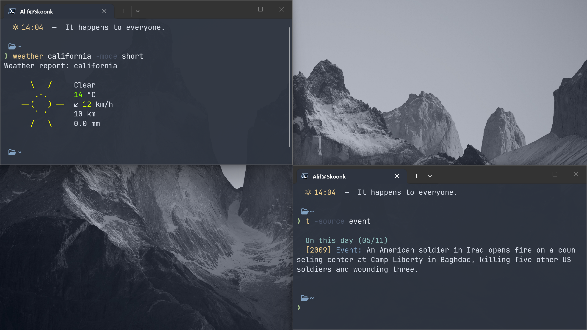

# dotfiles

> Personal config files and settings for funsies.





## Configuration Details

<details>
<summary><h2>PowerShell</h2></summary>

- Nord color palette throughout all outputs
- Modular
- Dynamic time-based greeting with icons
- Weather reports for any location (Full, Short, Line, Moon modes)
- Daily historical trivia from Wikipedia
- Random advice generation
- Google search from terminal
- Fuzzy search for command history (Ctrl+R) and files (Ctrl+T)
- Starship prompt integration
- Zoxide smart directory jumping

## Commands

| Command | Aliases | Description |
|---------|---------|-------------|
| weather [city] | - | Get weather forecast fetched from wttr.in |
| advice | - | Random life advice |
| t | Get-Trivia | Daily historical events |
| g query | google | Open Google search in browser |
| h | helpme | Show all commands |
| home | - | Go to home directory |
| cl | - | Clear screen |
| pingtest | - | Ping Google DNS |
| ff | - | Show system info (fastfetch) |
| z dir | - | Smart directory jump (zoxide) |

## Keyboard Shortcuts

| Shortcut | Action |
|----------|--------|
| Ctrl+R | Fuzzy search command history |
| Ctrl+T | Fuzzy search files |

</details>

<details>
<summary><h2>CAVA</h2></summary>

- Nord color palette with 8-step gradient from blues to warm reds
- Mono output with averaged channels as it should be
- Reduced noise smoothing (0.98 noise reduction)
- Frequency range: 30 Hz – 15 kHz (covers sub-bass to high treble)

</details>

<details>
<summary><h2>Starship</h2></summary>

- Nord color palette
- SSH-only hostname, sudo indicator, directory, git branch/status, command duration, Python version, then character prompt on new line
- Username hidden by default (root-only for cleaner prompts)
- Git status: conflicts, ahead/behind, diverged, untracked, stashed, modified, staged, renamed, deleted
- Slow command tracking (>2 seconds)
- Directory truncation: 3 parent folders with ellipsis, repo root detection, read-only lock icon
- Chevron reverses (❯ → ❮) in normal mode, green on success, red on error

</details>

<details>
<summary><h2>Sublime Text 4</h2></summary>

- Hardware Acceleration with OpenGL and GPU window buffer enabled
- Smooth scrolling enabled with smooth caret style
- Font set to JetBrainsMono NF with gray and subpixel antialiasing
- Theme Adaptive with Nord color palette
- Line highlighting enabled
- Scrollbar always visible with faded style
- Line padding 1px top and bottom for compact view
- Scroll past end enabled
- White space only shown on selection
- Word wrap auto with subsequent line indent
- Save actions trim trailing whitespace and ensure newline at EOF
- Find auto selects in selection and finds selected text by default
- Preview on click disabled, opens files directly
- Modified tabs highlighted
- Keep empty windows open
- Mini diff enabled for change tracking
- Atomic save prevents partial writes
- Shift tab unindents properly
- Drag text disabled
- Relative line numbers commented out as optional

</details>

## Dependencies

### Prerequisites

- [PowerShell 7+](https://github.com/PowerShell/PowerShell/releases)
- JetBrainsMono Nerd Font — install it first, then set it as your terminal font, otherwise icons will break

### Install via Scoop + winget

Open PowerShell as Administrator and run:

```powershell
# Scoop packages
scoop bucket add nerd-fonts
scoop install starship fzf zoxide fastfetch btop JetBrainsMono-NF

# PSFzf (PowerShell module)
Install-Module -Name PSFzf -Scope CurrentUser

# cava (not in scoop, use winget)
winget install -e --id karlstav.cava
```

### PowerShell modules

```powershell
Install-Module -Name PSFzf -Scope CurrentUser
```

> Required for Ctrl+R history search and Ctrl+T file search.

## Folder Structure

```
.dotfiles/
├── readme.md                          # This file
├── assets/                            # Miscellaneous assets
├── config/                            # Configuration files
│   ├── starship.toml
│   ├── cava/
│   └── fastfetch/
├── cursor/                            # Cursor pack + install script
├── powershell/                        # PowerShell configuration
│   ├── Microsoft.PowerShell_profile.ps1  # PowerShell profile
│   └── Modules/                       # Custom PowerShell modules
│       ├── api.ps1                    # API utilities
│       ├── core.ps1                   # Core functions
│       ├── fzf.ps1                    # Fuzzy finder integration
│       ├── ui.ps1                     # UI utilities
│       └── utils.ps1                  # General utilities
├── sublime text/                      # Sublime Text configuration
│   └── Preferences.sublime-settings
└── wallpapers/                        # Desktop wallpapers
```
## Homework

- [x] One-click install script
- [ ] Better screenshots

## Additional Notes

No transparency, tiling, status panels, or other eye candy. These dotfiles are exclusively for my work laptop with a weak iGPU and 8GB RAM. Less overhead = better thermals and efficiency. Ironic, since these dotfiles are still eye candy anyway.

## Credit
[jimmyxd2](https://www.deviantart.com/jimmyxd2) for Mac Tahoe cursor pack, thanks!
