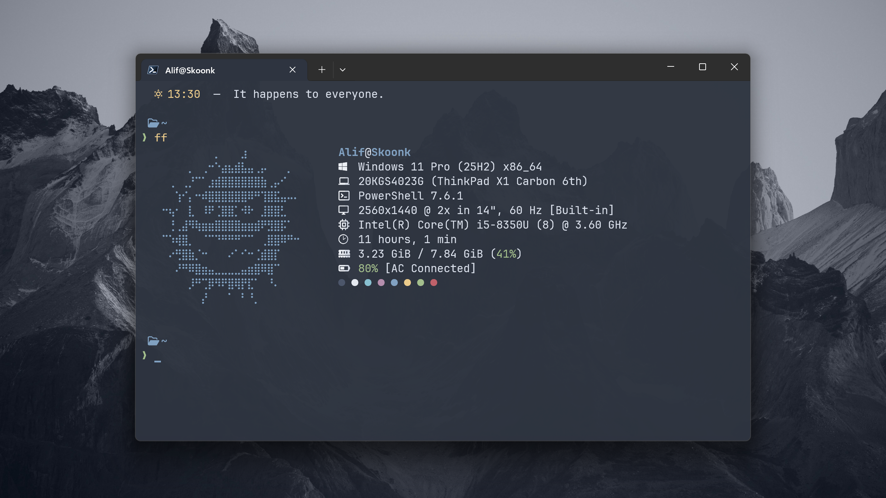
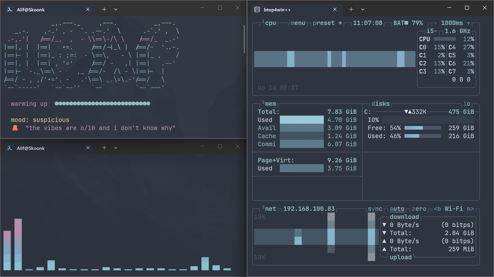
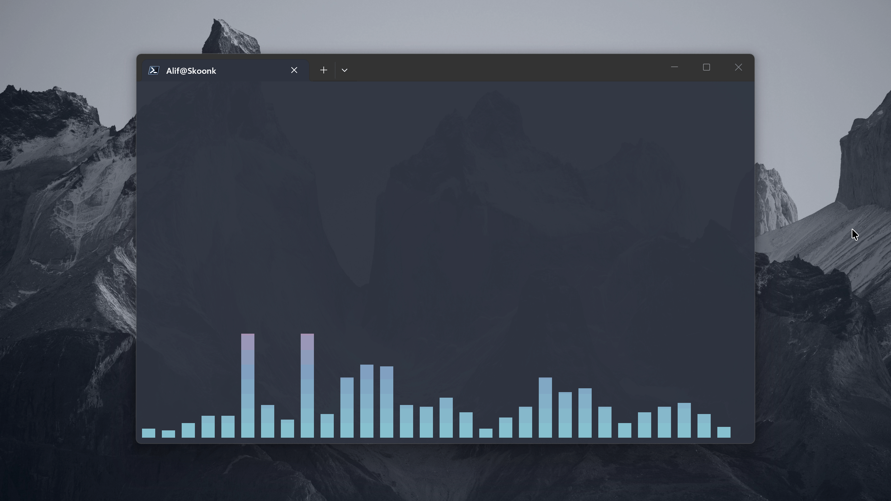

# .dotfiles

Personal configuration files and settings for funsies.







## Dependencies

- [fzf](https://github.com/junegunn/fzf)
- [zoxide](https://github.com/ajeetdsouza/zoxide)

## Folder Structure

```
.dotfiles/
├── readme.md                          # This file
│
├── assets/                            # Miscellaneous assets
│
├── powershell/                        # PowerShell configuration
│   ├── Microsoft.PowerShell_profile.ps1  # PowerShell profile
│   └── Modules/                       # Custom PowerShell modules
│       ├── api.ps1                    # API utilities
│       ├── core.ps1                   # Core functions
│       ├── fzf.ps1                    # Fuzzy finder integration
│       ├── ui.ps1                     # UI utilities
│       └── utils.ps1                  # General utilities
│
└── sublime text/                      # Sublime Text configuration
    ├── Packages/
    │   └── User/                      # Custom settings
    │       ├── Default (Windows).sublime-keymap
    │       ├── Markdown GFM.sublime-settings
    │       ├── Markdown.sublime-settings
    │       ├── MultiMarkdown.sublime-settings
    │       ├── Package Control.sublime-settings
    │       └── Preferences.sublime-settings
    └── wallpapers/                    # Desktop wallpapers
```

## TODO

- [ ] One-click install script